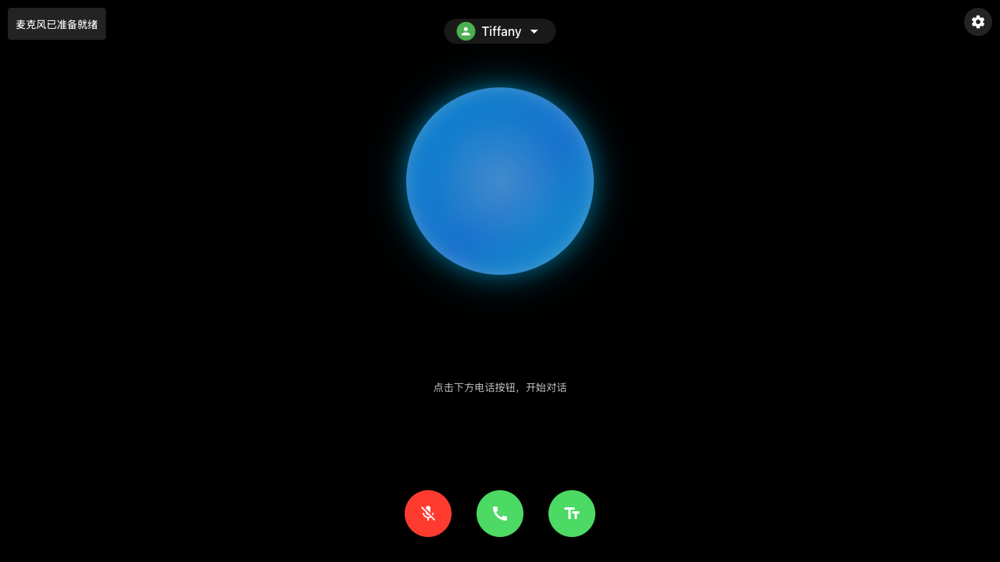
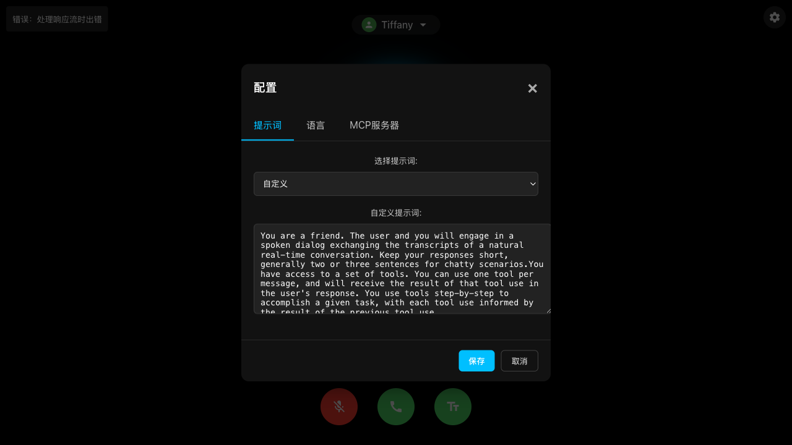
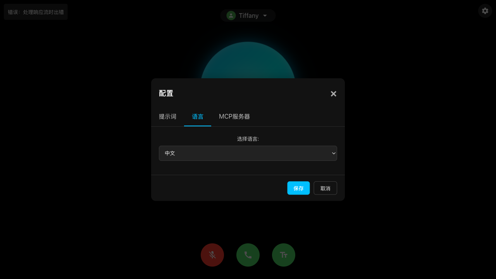
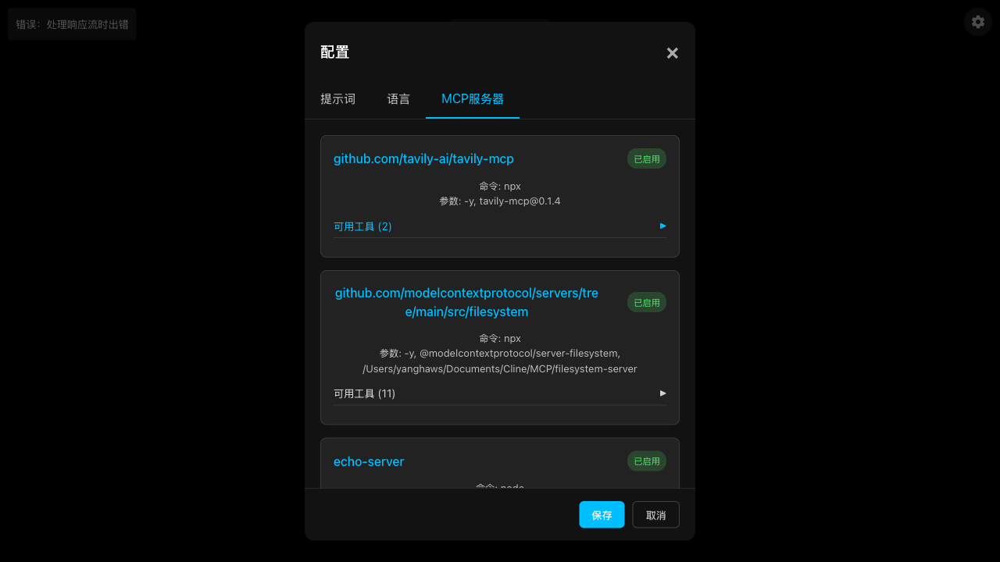
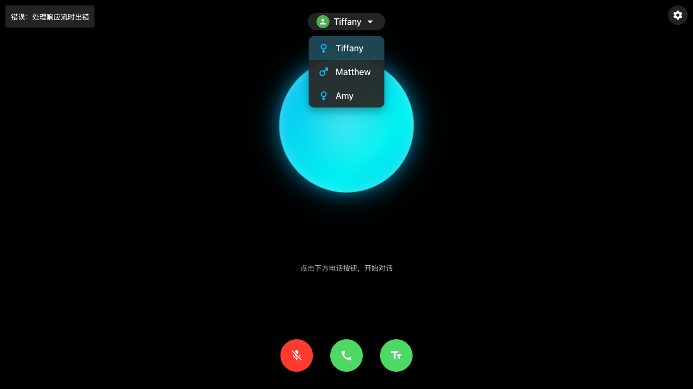

## Amazon Nova Sonic and MCP

This project implements a WebSocket-based bidirectional audio streaming application integrated with Amazon Nova Sonic model for real-time speech-to-speech conversations. The application enables natural conversational interactions through a modern web interface while leveraging Amazon's powerful Nova Sonic model for processing and generating responses.

English | [中文](README_CN.md)

## Project Overview

Amazon Nova Sonic is an advanced speech model provided by AWS Bedrock, capable of processing natural human voice input and generating high-quality speech responses. This project demonstrates how to build a complete application system, including:

- **Bidirectional real-time audio streaming**: Supports continuous voice input and output for a natural conversation experience
- **Multi-language support**: Built-in bilingual interface (English and Chinese) that can be easily switched
- **Multiple voice options**: Supports various AI voice personas (tiffany, matthew, amy, etc.)
- **Tool integration system**: Supports extended functionality through MCP (Model Context Protocol)
- **WebSocket real-time communication**: Ensures low-latency audio transmission and processing
- **Responsive web interface**: Modern user interface that adapts to different devices
- **Audio visualization**: Real-time audio waveform display to enhance user experience
- **CLI mode support**: Ability to interact using pre-recorded audio through command line
- **Environment-based configuration**: All settings configurable via environment variables for easy deployment
- **Docker support**: Containerized deployment with Docker and Docker Compose

The system consists of a server that handles bidirectional streaming and AWS Bedrock integration, along with a modern web client that manages audio streams and user interactions. It supports real-time audio streaming, integration with Amazon Nova Sonic model, bidirectional communication processing, and a responsive web interface with chat history management.

## Usage Instructions

### System Requirements

- Node.js (v18.0.0 or higher)
- AWS account with Bedrock access enabled
- AWS CLI configured with appropriate credentials
- Modern browser with WebAudio API support
- Microphone and speakers for audio capture and playback

### Dependencies

The project uses the following main dependencies:

```json
{
  "dependencies": {
    "@aws-sdk/client-bedrock-runtime": "^3.787.0",
    "@aws-sdk/credential-providers": "^3.787.0",
    "@modelcontextprotocol/sdk": "^1.9.0",
    "@smithy/node-http-handler": "^4.0.4",
    "@smithy/types": "^4.2.0",
    "axios": "^1.8.4",
    "cors": "^2.8.5",
    "express": "^4.18.0",
    "rxjs": "^7.8.2",
    "socket.io": "^4.8.1"
  }
}
```

### Installation Steps

1. Clone the repository:

```bash
git clone <repository-url>
cd aws-nova-sonic-mcp
```

2. Install dependencies:

```bash
npm install
```

3. Configure AWS credentials:

```bash
# Configure AWS CLI with your credentials
aws configure --profile default
```

4. Build TypeScript code:

```bash
npm run build
```

### Quick Start

1. Start the server:

```bash
npm start
```

2. Open in browser:

```
http://localhost:3000
```

3. Grant microphone permissions when prompted.

4. Click the call button to start a conversation.



After the application loads, you will see the interface as shown above. The interface is divided into the following main sections:

- **Top status bar**: Displays connection status and voice persona selector
- **Central interaction area**: Large blue circular audio visualization display area
- **Bottom control bar**: Microphone control, call control, and text display buttons

### Configuration Options

#### System Prompts

You can customize system prompts through the configuration button on the interface. The system provides multiple preset templates, and you can also write custom prompts.

```javascript
// Custom system prompt example
const SYSTEM_PROMPT =
  "You are an assistant. The user and you will have a spoken conversation...";
socket.emit("systemPrompt", SYSTEM_PROMPT);
```

#### Voice Configuration

Multiple AI voice personas are supported and can be selected from the user avatar dropdown menu:

```javascript
// Voice configuration example
socket.emit("voiceConfig", { voiceId: "tiffany" });
```

#### Language Settings

English and Chinese interface switching is supported:

```javascript
// Language setting options
const currentLanguage = "en"; // English, can be set to "zh" for Chinese
updateUITexts(); // Update interface text
```

#### MCP Server Configuration

Configure MCP servers through the `mcp_config.json` file:

```json
{
  "mcpServers": {
    "github.com/tavily-ai/tavily-mcp": {
      "command": "npx",
      "args": ["-y", "tavily-mcp@0.1.4"],
      "env": {
        "TAVILY_API_KEY": "your-api-key"
      },
      "disabled": false,
      "autoApprove": []
    }
  }
}
```

### Command Line Interface (CLI) Mode

You can use CLI mode to process pre-recorded audio files:

```bash
# Run in CLI mode
npm run cli -- --input=/path/to/audio.wav
```

### Troubleshooting

1. Microphone Access Issues

- Problem: Browser displays "Microphone permission denied"
- Solution:
  ```javascript
  // Check microphone permissions
  const permissions = await navigator.permissions.query({ name: "microphone" });
  if (permissions.state === "denied") {
    console.error("Microphone access permission required");
    // Display instructions to guide users to enable permissions
  }
  ```

2. Audio Playback Issues

- Problem: No audio output
- Solution:

  ```javascript
  // Verify if AudioContext is initialized
  if (audioContext.state === "suspended") {
    await audioContext.resume();
  }

  // Check audio player
  if (!audioPlayer.initialized) {
    await audioPlayer.start();
  }
  ```

3. Connection Issues

- Check server logs
- Verify AWS credential configuration
- Validate WebSocket connection:
  ```javascript
  socket.on("connect_error", (error) => {
    console.error("Connection failed:", error);
  });
  ```

4. Session Timeout Issues

- Problem: Session disconnects after a period of inactivity
- Solution: The system has a 5-minute automatic session cleanup, which can be adjusted in `server.ts`

### Client-side Audio Processing

- Uses WebAudio API to capture and process audio
- 16kHz sampling rate, mono PCM format
- Real-time audio visualization display
- Audio interruption (Barge-in) support, allowing users to interrupt AI responses at any time

### Server-side Audio Processing

- Uses HTTP/2 streaming for efficient communication
- Supports concurrent processing of multiple sessions
- Automatic session cleanup mechanism to prevent resource leaks

## Infrastructure

The application runs on a Node.js server with the following key components:

- Express.js server handling WebSocket connections and HTTP requests
- Socket.IO for real-time communication
- Nova Sonic client for speech-to-speech model processing
- MCP tool integration system for extended functionality

## Web Interface Features

The application provides a modern web interface with the following features:

### Main Interface


The main interface contains the following key elements:

- **Connection status indicator**: Top-left corner displays the current connection status, such as "Connected to server" or error messages
- **Voice persona selection**: Top-center dropdown menu for selecting different AI voice personas
- **Settings button**: Top-right gear icon for opening the configuration panel
- **Audio visualization**: Central blue circular area displaying real-time audio waveforms and speech activity
- **Control buttons**:
  - Bottom-left microphone button: Controls microphone on/off
  - Center call button: Starts/ends conversation (red indicates active conversation)
  - Bottom-right text button: Toggles display/hide of text conversation content

### Conversation Interface

- Real-time display of conversation history
- Support for showing/hiding text conversation content
- Audio visualization displaying user and assistant speech activity
- Multi-language UI support (English and Chinese)

### Configuration Panel





The configuration panel contains three main tabs:

1. **Prompts Tab**

   - Provides system prompt template selection dropdown
   - Displays current system prompt text content
   - Supports custom prompt editing

2. **Language Tab**

   - Provides interface language selection (English and Chinese supported)
   - Simple and intuitive language switching interface

3. **MCP Servers Tab**
   - Displays all configured MCP servers
   - Includes server URL, command, parameters, and enabled status
   - Shows the number of available tools provided by each server
   - Can be expanded to view detailed tool information

### Voice Persona Selection



- Supports multiple AI voice persona options:
  - Tiffany (female) - Default voice, natural and friendly tone
  - Matthew (male) - Calm and professional male voice
  - Amy (female) - Clear and lively female voice
- Each voice persona comes with an icon indicating gender
- Users can switch voices at any time, changes apply immediately to the next AI response


## Docker Deployment

The project now includes a complete Docker setup for easy deployment:

```bash
# Build the Docker image
docker build -t nova-sonic-app .

# Run with environment variables
docker run -p 3000:3000 \
  -e AWS_REGION=us-west-2 \
  -e KB_ID=your-kb-id \
  -e DEFAULT_VOICE_ID=matthew \
  nova-sonic-app
```

Or use Docker Compose for a more complete setup:

```bash
# Start with Docker Compose
docker-compose up -d
```

See the `ENV_CONFIG.md` file for a comprehensive list of all available environment variables.

## AWS Deployment

### Deploy to AWS ECS (Elastic Container Service)

1. **Build and push the Docker image**:
   ```bash
   # Build the Docker image
   docker build -t nova-sonic-app .
   
   # Tag the image for ECR
   docker tag nova-sonic-app:latest 123456789012.dkr.ecr.us-west-2.amazonaws.com/nova-sonic-app:latest
   
   # Push to ECR
   docker push 123456789012.dkr.ecr.us-west-2.amazonaws.com/nova-sonic-app:latest
   ```

2. **Create ECS task definition with environment variables**:
   - Use the AWS Console or CLI to create a task definition
   - Add environment variables as described in `ENV_CONFIG.md`
   - Use IAM roles instead of hardcoded AWS credentials
   - Use AWS Secrets Manager for sensitive values like API tokens

3. **Create an ECS service**:
   - Configure desired count, networking, and load balancing
   - Set up service auto-scaling if needed

For detailed instructions on configuring environment variables for deployment, refer to the `ENV_CONFIG.md` file.

### Knowledge Base Integration

To integrate with a knowledge base:

1. Set the `KB_ID` environment variable to your knowledge base ID
2. Configure an MCP server that connects to your knowledge base service
3. Set any required API keys using the `MCP_SERVER_TOKEN_` environment variables

Example:
```bash
# Knowledge base ID
KB_ID=kb-123456

# MCP server for knowledge base access
MCP_SERVER_KB={"transportType":"streamable_http","command":"restful","baseUrl":"https://api.example.com/kb-service"}

# API token for the knowledge base service
MCP_SERVER_TOKEN_KB=your-api-key-here
```

## Security Considerations

- All AWS credentials should be properly secured and not embedded directly in code
- Use IAM roles for AWS service authentication rather than access keys
- Store sensitive tokens in AWS Secrets Manager or Parameter Store
- WebSocket connections are configured with CORS protection
- API secure access can be implemented through token mechanisms
- Consider enabling HTTPS in production environments
- MCP tool execution requires appropriate security restrictions

## Contribution Guidelines

Contributions to this project are welcome:

1. Fork the repository
2. Create your feature branch (`git checkout -b feature/amazing-feature`)
3. Commit your changes (`git commit -m 'Add some amazing feature'`)
4. Push to the branch (`git push origin feature/amazing-feature`)
5. Open a Pull Request

## License

This project is licensed under the ISC License - see the LICENSE file for details.

## Related Resources

- [AWS Bedrock Documentation](https://docs.aws.amazon.com/bedrock/)
- [Nova Sonic Model Guide](https://docs.aws.amazon.com/bedrock/latest/userguide/model-ids-nova-sonic.html)
- [Model Context Protocol](https://github.com/model-context-protocol/mcp)
